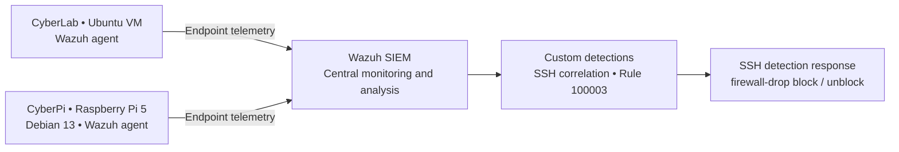

# Wazuh SOC Homelab

**Linux security monitoring · Detection engineering · Automated response · System hardening**

A hands-on cybersecurity homelab built and operated by **Akio Simmonds**, combining an Ubuntu virtual machine with a physical Raspberry Pi 5. Wazuh brings endpoint telemetry together for custom detections, controlled validation, automated response, file integrity monitoring, vulnerability triage, and configuration assessment.

The central engineering exercise connects **security events → correlation → alert review → response validation**. Linux hardening and risk-based assessment complement that detection work.

> **Status:** Active development. The capabilities below reflect completed work reported in the project record. CIS Debian 13 hardening remains in progress. This initial publication documents that record; sanitized rule exports, configuration files, logs, and screenshots have not yet been added. See [evidence status](docs/evidence-register.md).

## Highlights

| Area | Completed work |
| --- | --- |
| Multi-endpoint monitoring | Wazuh monitoring of the CyberLab Ubuntu VM and CyberPi Raspberry Pi 5 running Debian 13 |
| SSH brute-force detection | Custom correlation of **five invalid authentication attempts within 60 seconds** |
| Automated response | Wazuh `firewall-drop` automatically blocks and subsequently unblocks the source during controlled testing |
| Account deletion detection | Custom rule **100003** for privileged Linux account deletion, mapped to **MITRE ATT&CK T1531 — Account Access Removal** |
| Detection validation | Controlled testing and rule tuning to reduce duplicate alerts |
| Endpoint telemetry | Real-time file integrity monitoring and Linux `auditd` integration |
| Vulnerability management | Contextual CVE triage of affected packages/components, runtime exposure, and available remediation |
| Linux hardening | SSH public-key authentication, password/root SSH disabled, UFW SSH restrictions, service reduction, cron permissions, and login banners |
| Network services | Pi-hole DNS filtering for multiple endpoints and Tailscale remote connectivity |
| Configuration assessment | CyberPi Wazuh SCA score progressed from **41% to at least 52%**; hardening and exception review continue |

## Environment at a glance

This is a logical view of confirmed components, not a deployment or network topology. The Wazuh server location, network boundaries, service placement, and response execution target are not specified in the available record. Pi-hole and Tailscale are documented separately without inferring their placement. See [architecture](architecture/README.md).

## Detection and response case studies

### SSH brute-force correlation and containment

The custom detection correlates five invalid SSH authentication attempts within 60 seconds. Controlled testing exercised detection behavior and the associated Wazuh Active Response `firewall-drop` block/unblock sequence. This demonstrates the connection between correlation and an operational response, including removal of the block.

[Detection notes](detection-engineering/ssh-brute-force/README.md) · [Active Response notes](active-response/README.md)

### Privileged Linux account deletion

Custom rule **100003** uses Linux audit telemetry to detect privileged account deletion and carries the **T1531** mapping. Controlled validation and tuning addressed duplicate alerts. Exact rule conditions and the definition of a privileged account must be documented from the actual configuration before the detection can be reproduced.

[Detection notes](detection-engineering/privileged-account-deletion/README.md) · [auditd integration](auditd/README.md)

## CyberPi hardening: progress with context

CyberPi is a Raspberry Pi 5 running Debian 13 and enrolled in Wazuh. Completed hardening includes SSH public-key authentication, disabling password and root SSH authentication, restricting SSH through UFW, reducing unnecessary services, hardening cron permissions, and configuring login banners.

Wazuh SCA reported an initial **41%** score and a subsequent score of **at least 52%**. This is an interim assessment result, not a final compliance claim or a measure of total security. CIS findings have been evaluated using risk-based exceptions and architecture-specific scanner mismatch analysis.

[CyberPi](cyberpi/README.md) · [CIS progress and exceptions](cyberpi/cis-hardening.md)

## Repository guide

| Directory | Contents |
| --- | --- |
| [architecture/](architecture/README.md) | Confirmed components, logical data flow, and topology limits |
| [detection-engineering/](detection-engineering/README.md) | SSH brute-force and privileged account deletion case studies |
| [active-response/](active-response/README.md) | Validated block/unblock behavior and evidence still needed |
| [file-integrity-monitoring/](file-integrity-monitoring/README.md) | Real-time monitoring and file-change reporting |
| [auditd/](auditd/README.md) | Linux audit telemetry integration |
| [vulnerability-management/](vulnerability-management/README.md) | Contextual CVE triage approach |
| [cyberpi/](cyberpi/README.md) | Debian 13 endpoint security and ongoing CIS hardening |
| [network-services/](network-services/README.md) | Pi-hole and Tailscale |
| [screenshots/](screenshots/README.md) | Evidence capture and publication guidance; no screenshots yet |
| [docs/](docs/README.md) | Evidence register, troubleshooting, and lessons learned |

## Scope and next documentation steps

This repository describes a personal homelab. It does not claim production SOC operations, complete CIS compliance, measured detection accuracy, or a fully reproducible deployment.

Next documentation work is to add reviewed, sanitized artifacts from the actual environment: custom rules, matched events, block/unblock records, architecture details, and before/after SCA results. These are pending documentation tasks, not additional completed accomplishments.
